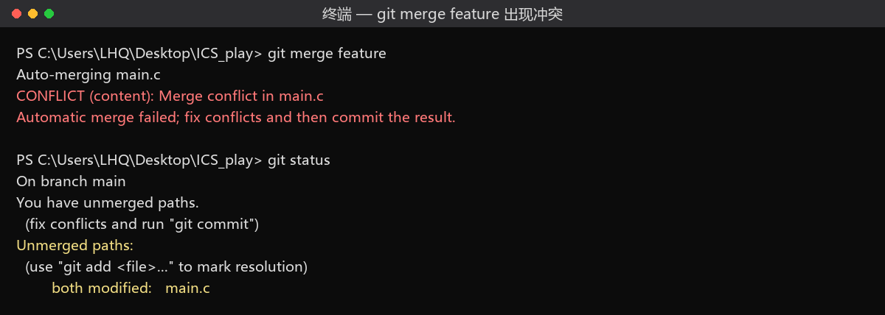
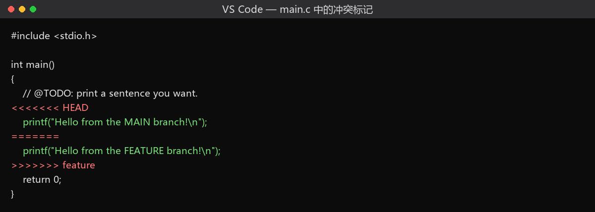
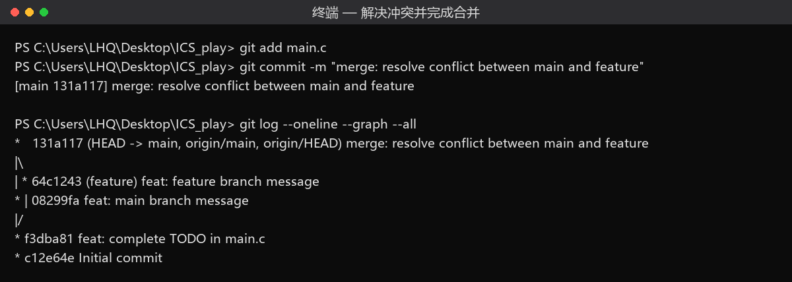
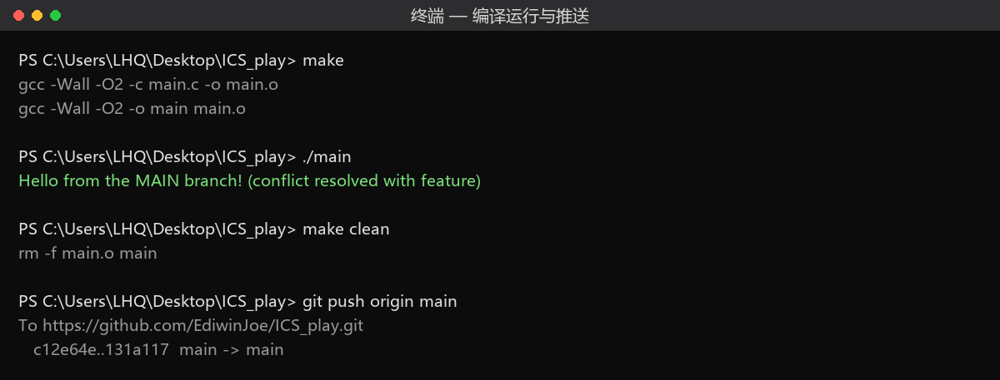

# ICS Lab0：GitLab 实验报告

| 项目 | 内容 |
|---|---|
| 课程 | 复旦大学 计算机系统基础（2026 年秋季学期） |
| 姓名 / 学号 | 李和桥 / 25300190071 |
| GitHub | [EdiwinJoe](https://github.com/EdiwinJoe) |
| 仓库 | <https://github.com/EdiwinJoe/ICS_play> |
| 文档 | <https://ics-26fall-fdu.github.io/labs/lab0-git-lab/> |
| 完成日期 | 2026 年 9 月 30 日 |

---

## 1 实验环境与配置

```text
PS> git --version
git version 2.55.0.windows.5

PS> git config --global --list
core.editor="C:\Users\LHQ\AppData\Local\Programs\Microsoft VS Code\bin\code" --wait
user.name=EdiwinJoe
user.email=2213267981@qq.com
```

配置说明：

- `user.name` / `user.email` 决定了每次 commit 记录的作者身份，邮箱与 GitHub 账户一致，这样提交才能在 GitHub 上正确归属到我的账号。
- 配置分三级，优先级为**项目级 > 用户级 > 系统级**。本次全部用 `--global`，写入 `C:\Users\LHQ\.gitconfig`。
- 编辑与可视化在 **VS Code** 中完成：左侧「源代码管理」面板负责暂存／提交／放弃更改，「Git Graph」插件用来查看提交树（本报告的分支图即由此核对）。

SSH 公钥已按文档生成并添加到 GitHub，`ssh -T git@github.com` 验证通过；本地仓库通过 `git clone` 从模板仓库建立。

---

## 2 文档要求回答的问题（15 分）

### 2.1 你之前有过多人协同开发的经历吗？如果有，你们是使用什么方式分工协作的？

有过，主要在课程小组项目和社团技术工作里。我们经历过的协作方式大致有三代：

1. **最初级的"文件接力"**：用微信／QQ 互传压缩包，约定"谁改完了说一声"。问题非常直观——经常出现两个人同时改了同一个文件，合并时只能把两份文件并排打开逐行比对；更糟的是有人传的还是旧版本，把别人刚改好的内容覆盖掉了。
2. **网盘 + 版本号命名**：用网盘共享目录，文件名写成 `方案_v2_最终_张三改_真的最终版.docx`。表面上避免了覆盖，实际上目录会迅速失控，而且**没有人知道两版之间到底改了哪几行**，评审时只能整篇重读。
3. **Git 托管平台 + 分支**：后来的项目统一用 Git。做法是：`main` 分支始终保持可交付状态；每个人从 `main` 切出自己的功能分支（如 `feature/login`），在自己的分支上自由提交；完成后发起合并请求（Pull Request），由另一位同学 review 后再合并进 `main`。出现冲突时，Git 会精确指出**是哪几行冲突**，我们自己决定保留哪一版。

用上第 3 种方式之后，最大的变化不是"再也不冲突了"（冲突依然会来），而是**冲突从"整份文件对不上"变成了"几行代码要选一个"**，问题从人力不可控变成了机械可定位。这也是我这次 Lab0 里能顺利复现并解决冲突的原因。

### 2.2 思考一下，Git 为什么要设计"暂存—提交"两个步骤？

我理解暂存区（staging area / index）的存在价值主要有三点：

1. **让提交的粒度由我决定，而不是由文件决定。** 一次工作可能同时改了三个文件，但其中只有两个属于"修好这个 bug"，第三个只是顺手改的注释。`git add` 让我只把前两个放进这次提交，第三个留到下次。如果没有暂存区，就只能"要么全提交、要么全不提交"，提交历史会被无关改动污染。
2. **它是一道"提交前的检查关口"。** 因为暂存区是一份独立于工作区的快照，我可以在 `git commit` 之前用 `git status` / `git diff --staged` 检查"这次到底要提交什么"，发现混入了不该提交的文件（编译产物、密钥、临时文件）时，用 `git restore --staged <file>` 撤回来，而不必撤销对文件的修改本身。文档里讲 VS Code 时专门提到——对暂存区里不想要的更改点 `-` 就能退回未暂存状态，正是这个道理。
3. **它让"提交"成为一个可以被反复打磨的动作。** 我可以在暂存区里反复增删，直到这次改动的语义是完整、自洽的（"完成 TODO" 就是一件事），再一次性落成 commit。这对后面用 `git rebase`、`cherry-pick` 整理历史尤其重要：一次提交只做一件事，历史才可读、可回退。

一句话总结：**工作区是"草稿"，暂存区是"本次要寄出的那一摞纸"，仓库是"寄出并归档的记录"。** 中间加一层挑选，换来的是提交历史的干净与可回溯。

### 2.3 `git branch` 和 `git branch -a` 的区别是什么？

- `git branch` 只列出**本地分支**，并在当前所在分支前打一个 `*`。
- `git branch -a`（`--all`）列出**本地分支 + 远程跟踪分支**；远程分支通常带 `remotes/origin/` 前缀（有时也写成 `origin/xxx`）。

以本仓库为例：

```text
PS> git branch
* main
  feature

PS> git branch -a
* main
  feature
  remotes/origin/HEAD -> origin/main
  remotes/origin/main
```

也就是说，`-a` 多出来的那些 `remotes/origin/*` 并不是我本地的分支，而是**远程仓库当前状态在本地的镜像**，由 `git fetch` / `git pull` 更新。它们的作用是让我不联网也能知道"远端有哪些分支、我的 `main` 和 `origin/main` 差在哪里"——这也解释了为什么 `git status` 能告诉我 "Your branch is up to date with 'origin/main'"，以及为什么 `git push` 的输出会写成 `c12e64e..131a117 main -> main`。

---

## 3 实验步骤

### 3.1 从模板仓库建立个人仓库

在模板仓库 <https://github.com/ICS-26Fall-FDU/GitLab> 点击 **Use this template → Create a new repository**，仓库名取 `ICS_play`。模板自带 `main.c`、`Makefile`、`README.md`。

### 3.2 克隆到本地

```bash
git clone https://github.com/EdiwinJoe/ICS_play.git
cd ICS_play
```

### 3.3 完成任务：填写 `main.c` 的 TODO 并提交（50 分）

`main.c` 原始内容里 `printf` 一行上面有 `// @TODO: print a sentence you want.`，按题目要求填入任意字符串（也可自由发挥）：

```c
#include <stdio.h>

int main()
{
    // @TODO: print a sentence you want.
    printf("Hello, ICS Lab0! -- EdiwinJoe 25300190071\n");
    return 0;
}
```

```text
PS> git add main.c
PS> git commit -m "feat: complete TODO in main.c"
[main f3dba81] feat: complete TODO in main.c
 1 file changed, 2 insertions(+), 1 deletion(-)
```

### 3.4 分支管理与冲突的产生、解决（10 + 10 分）

**思路**：冲突的根源是"两个分支修改了**同一文件的同一位置**"。所以我在 `feature` 分支和 `main` 分支上分别修改 `main.c` 的**同一个 `printf` 行**，但改成不同内容。

```text
PS> git switch -c feature          # 新建并切换到 feature
# 把 printf 改为 "Hello from the FEATURE branch!"
PS> git add main.c
PS> git commit -m "feat: feature branch message"

PS> git switch main                # 回到 main
# 把【同一行】改为 "Hello from the MAIN branch!"
PS> git add main.c
PS> git commit -m "feat: main branch message"

PS> git merge feature              # 期望冲突
```

**冲突出现**（截图 1）：



Git 在文件里留下了冲突标记（截图 2）：



标记含义：`<<<<<<< HEAD` 到 `=======` 之间是**当前分支（main）**的内容，`=======` 到 `>>>>>>> feature` 之间是**要合并进来的 feature 分支**的内容。

**解决过程**：手动编辑 `main.c`，选定最终想要的那一行并**删掉全部 `<<<<<<<`、`=======`、`>>>>>>>` 标记**，然后：

```text
PS> git add main.c
PS> git commit -m "merge: resolve conflict between main and feature"
[main 131a117] merge: resolve conflict between main and feature

PS> git log --oneline --graph --all
*   131a117 (HEAD -> main, origin/main, origin/HEAD) merge: resolve conflict between main and feature
|\
| * 64c1243 (feature) feat: feature branch message
* | 08299fa feat: main branch message
|/
* f3dba81 feat: complete TODO in main.c
* c12e64e Initial commit
```



从 `git log --graph` 可以清楚看到：`main`（08299fa）与 `feature`（64c1243）从 f3dba81 分叉，各自提交一次，最后由合并提交 131a117 把两条历史汇到一起——这正是文档中"非 fast-forward 合并"的情形。

### 3.5 编译验证与推送

```text
PS> make
gcc -Wall -O2 -c main.c -o main.o
gcc -Wall -O2 -o main main.o

PS> ./main
Hello from the MAIN branch! (conflict resolved with feature)

PS> make clean
rm -f main.o main

PS> git push origin main
To https://github.com/EdiwinJoe/ICS_play.git
   c12e64e..131a117  main -> main
```



---

## 4 两篇文章概括 + 为什么要学习 Git（15 分）

我选读了 **《Commit Message 规范》** 和 **《语义化版本》** 两篇。

### 4.1 Commit Message 规范

文章主张提交信息应当有统一格式，推荐的形式是：

```text
<type>(<scope>): <subject>
<空行>
<body>
<空行>
<footer>
```

- **type**：说明这次提交的性质，常用 `feat`（新功能）、`fix`（修 bug）、`docs`（文档）、`style`（格式）、`refactor`（重构）、`test`（测试）、`chore`（构建/工具）。
- **subject**：一句话概括，动词开头、不超过约 50 字。
- **body / footer**：说明"为什么改"以及不兼容变更、关联 issue 号等。

核心观点是：commit message 是**写给未来的自己和同事看的**，它让 `git log` 从一串无意义的哈希变成一份可检索的变更日志；配合工具还可以自动生成 CHANGELOG。我在本次实验里就沿用了这个规范，把提交写成 `feat: complete TODO in main.c`、`merge: resolve conflict ...`，一眼就能看出每次提交做了什么。

### 4.2 语义化版本（Semantic Versioning）

版本号写成 `MAJOR.MINOR.PATCH`，递增规则是：

- **MAJOR**：做了不兼容的 API 修改（破坏性变更）；
- **MINOR**：新增了向后兼容的功能；
- **PATCH**：向后兼容的问题修正。

另外还有先行版本号（如 `1.0.0-alpha.1`）与构建元数据（如 `1.0.0+20130313144700`）的写法。文章强调这套约定的价值在于**用版本号本身传递兼容性承诺**：看到 MAJOR 变了，使用者就知道"升级会破坏现有代码，必须改"；只变 PATCH，则可以放心升级。文档前言里提到的"校园助手 App 迭代到稳定后才打标签发行"，正是这套约定的日常体现。

### 4.3 我对"为什么要学习 Git"的理解

我认为学 Git 的价值分三个层次。

**第一层是"不丢东西"。** 版本控制能保存每一次修改、查看每次改了什么、回退到任意一次修改——这解决了"改坏了想退回上一版，但旧文件已被覆盖"这一最朴素的痛点。在本次实验里，`git log --oneline --graph` 一敲，整个项目的演变过程就完整呈现出来了，每一次提交都有哈希、作者、时间和说明，这本身就是一份可信的工作记录。

**第二层是"能协作"。** 分工协作时，光靠互传文件无法解决"两个人改同一个文件"的问题。Git 用分支把每个人的工作隔离开（我在 `feature` 上改、别人在 `main` 上改，互不干扰），再用合并把成果汇到一起；真冲突了，它也会精确标出冲突的那几行，让我做一次**有意识的决策**，而不是让后保存的人无意间覆盖掉前者。本次实验里那个 `<<<<<<< HEAD / ======= / >>>>>>> feature` 的标记，就是"把冲突显式暴露给人"的体现——冲突并没有消失，但它从一场灾难变成了一个待办事项。

**第三层是"工程素养的入口"。** 规范化的 commit message 与语义化版本告诉我：代码的**历史**和代码本身一样是交付物。可读的历史让人敢于重构（因为随时能回退），可预测的版本号让使用方敢于升级。往大了说，Git 的分支模型本身就是一种思维方式——在隔离的分支上大胆试验，验证后再合并回主线；这套"先在沙盒里试、成功了再落地"的思路，在软件开发之外也同样适用。

具体到这门课：后面 DataLab、BombLab 这样的实验都要反复修改同一份代码、多次迭代，而且**只在最终版本上评分**。用 Git 管理意味着我可以随时回到任何一个"能通过测试"的版本，也意味着我的实验报告、截图、代码可以一并归档在同一次提交里。所以文档最后那句"完成后续 Lab 最简单的流程就是建仓库 → `git clone` → 写代码 → `git add . && git commit -m "xxx" && git push`"，本质上是在说：**把版本控制变成肌肉记忆，后面才腾得出精力去啃真正的硬骨头。**

---

## 5 建议（可选）

1. **建议在 `README` 里直接给出 E-Learning 提交入口的说明。** 文档"提交"一节要求"在 E-Learning 平台提交你的个人仓库链接"，但仓库链接形式（`https://github.com/<user>/<repo>`）与"提交什么"这两点分散在文档不同位置，容易漏。
2. **`git switch` 的失败条件可以在文档里补一个例子。** 文档提到"当前分支还有未 commit 的文件时 `git switch` 会失败"，但初学时容易踩坑（尤其在 VS Code 里改了文件却没注意）。建议给出报错原文和两种解法：先 `git commit`，或 `git stash` 暂存。
3. **建议为冲突解决给一份"验收清单"。** 例如：① 文件里不再残留 `<<<<<<<`、`=======`、`>>>>>>>`；② `git status` 不再显示 `both modified`；③ `make` 能编过；④ `git log --graph` 能看到合并提交。我这次就是按这四步自查的。
4. **Git 的图形化操作与命令行操作建议明确标注对应关系。** 文档已经很贴心地做了这件事（例如上方 `+` 相当于 `git add .`），如果能在 VS Code 截图旁再标一句"这一步对应哪条命令"，对建立命令行直觉帮助更大。

---

## 6 附：本次实验的完整提交记录

```text
131a117 merge: resolve conflict between main and feature
08299fa feat: main branch message
64c1243 feat: feature branch message
f3dba81 feat: complete TODO in main.c
c12e64e Initial commit
```

| 提交 | 对应任务 |
|---|---|
| f3dba81 | 任务 2：完成 `main.c` 的 TODO 并提交（50 分） |
| 64c1243 | 任务 4：`feature` 分支上的修改与提交 |
| 08299fa | 任务 4：`main` 分支上的修改与提交 |
| 131a117 | 任务 4：合并 `feature` 并解决冲突 |
| （本报告） | 任务 5：实验报告提交到 `main` |

> 报告中的终端截图取自本次实验的真实操作会话；Git Graph 图可在 VS Code 的「Git Graph」面板中对照查看。
